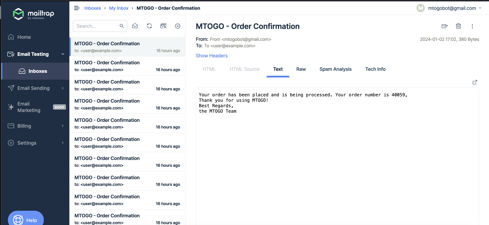
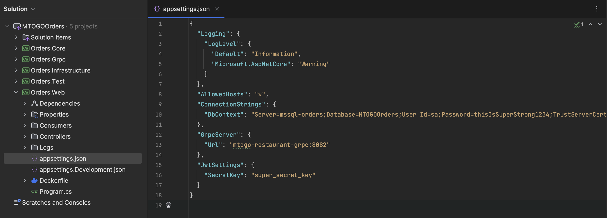
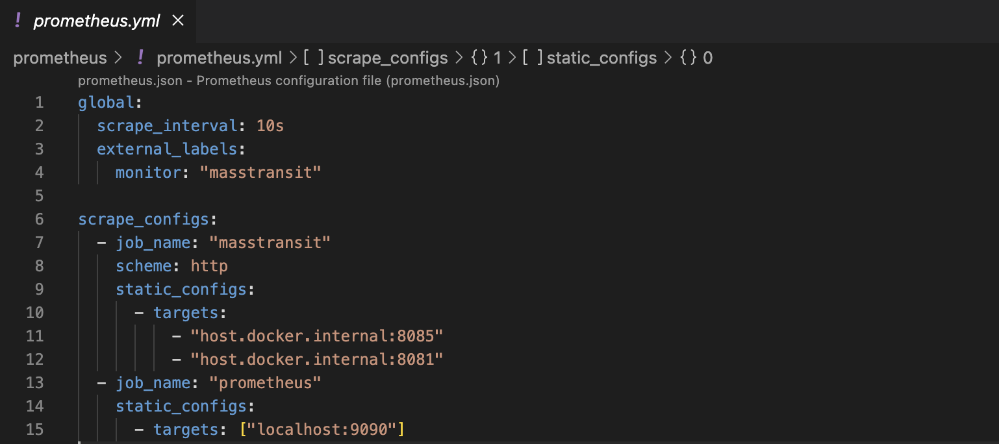
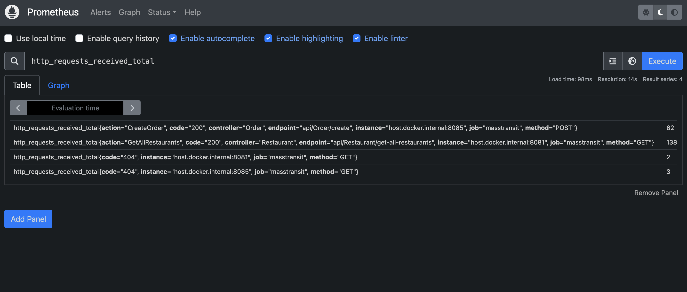
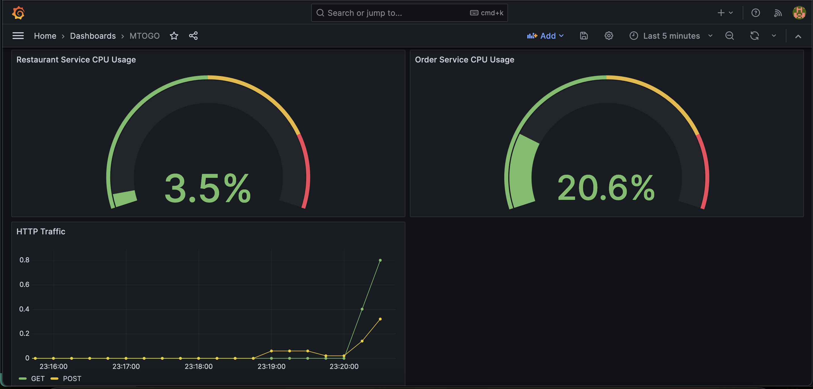
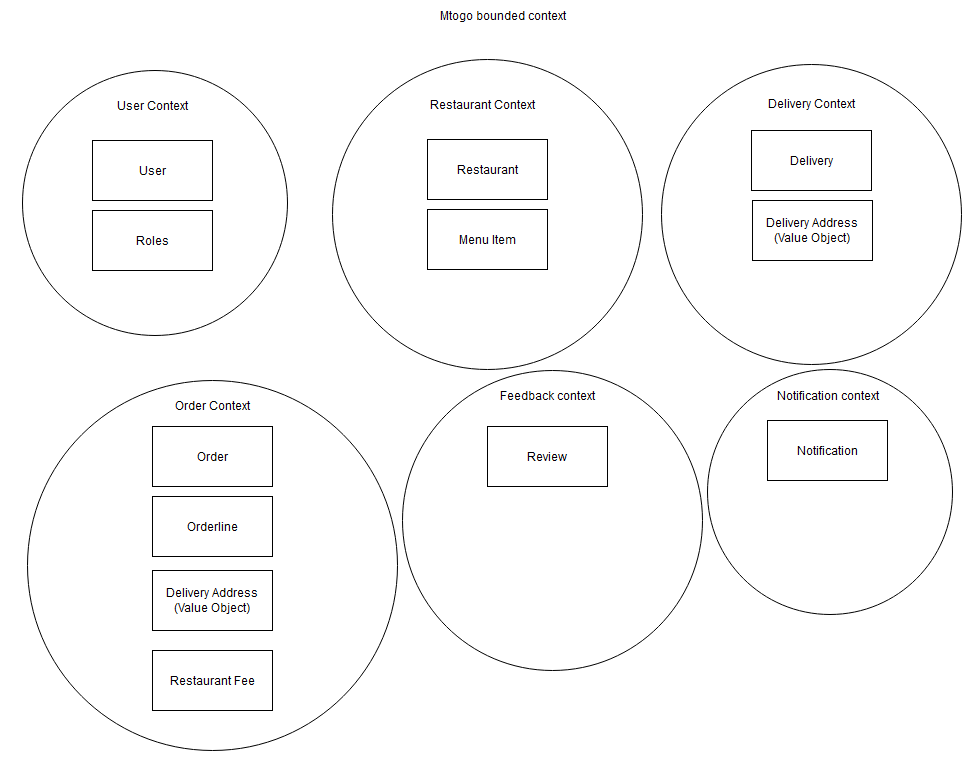
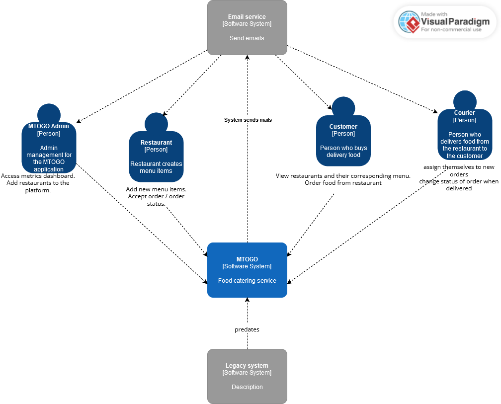
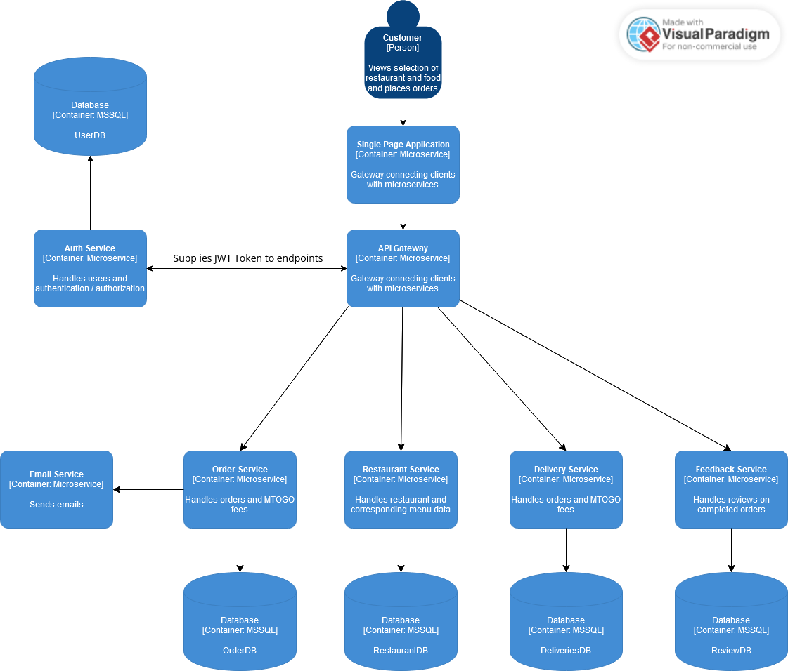
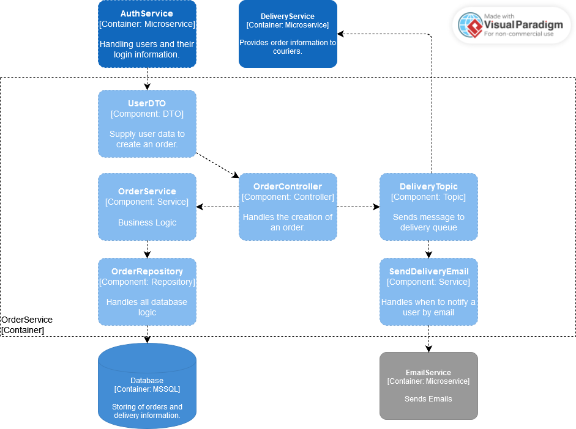

# Exam Repository - MTOGO #

## Contributors:

- **Frederik Bilgrav Andersen**: cph-fa116@cphbusiness.dk

- **Janus Stivang Rasmussen**: cph-jr270@cphbusiness.dk

- **Julius Krüger Madsen**: cph-jm352@cphbusiness.dk

# Table of Contents

# Table of Contents

1. [Setup](#setup)
2. [Legacy System](#legacy-system)
    - [Monolithic Legacy System](#monolithic-legacy-system)
    - [External APIs](#external-apis)
3. [Microservice Repositories](#microservice-repositories)
    - [API Gateway](#api-gateway)
    - [Order Service](#order-service)
    - [Restaurant Service](#restaurant-service)
    - [Auth Service](#auth-service)
    - [Feedback Service](#feedback-service)
    - [Delivery Service](#delivery-service)
    - [Email Service](#email-service)
    - [Notification Service](#notification-service)
    - [MTOGO Client](#mtogo-client)
4. [Microservice Configuration](#microservice-configuration)
5. [Application Monitoring](#application-monitoring)
6. [Architecture & Design](#architecture)
    - [Architecture](#architecture-diagram)
    - [BPMN Diagram (Create Order Flow)](#bpmn-diagram-create-order-flow)
    - [Legacy Domain Model](#legacy-domain-model)
    - [MTOGO Bounded Contexts](#mtogo-bounded-contexts)
    - [Usecase Diagram](#usecase-diagram)
    - [C4](#c4)
        - [C4 System Context](#c4-system-context)
        - [C4 Containers](#c4-containers)
        - [C4 Order Component](#c4-order-component)
7. [Docker](#docker)


## Setup
1. Clone this repository
2. In the root folder, copy and paste this command:
```docker-compose -f docker-compose.yml up -d --build```

## Legacy System
### Monolithic Legacy System
[Monolithic Legacy System](https://github.com/Dare-Share-Care/exam-legacy)


Prior to the development of the MTOGO Microservice Platform, we started development of a monolithic single-codebase system with the same functionality. This is to demonstrate, the usual flow where projects start as monolithic, and as scaling requirements and other variables are in-demand, it allows for refactoring to microservice architecture. We achieved this refactor using decoupling by domain-driven design. Here we analyzed the domain to find bounded contexts. Each bounded context would later serve as an independant microservice.

### External APIs
To make use of another existing "legacy system" that could complement our application, we decided to take use of an external geolocation API to convert the customers address from the created order to latitude and longitude. We did this to make use of another external API on our client-side providing a map of each active delivery a courier has claimed providing real-time navigation on the MTOGO platform for our couriers.

The APIs in question:

1. [LocationIQ (Geolocation API)](https://locationiq.com/)

2. [React Leaflet (React component for integrated maps)](https://react-leaflet.js.org/)


## Microservice Repositories ##

### API Gateway
[API Gateway](https://github.com/Dare-Share-Care/exam-gateway)  
handles the connection between the client and each microservice and serves as a main entrypoint. It is made using the Ocelot framework for .NET Core. The routing to each microservice corresponding API is configured in the ocelot.json file. Through ocelot, it is also possible to integrate load balancing and service discovery for distributed systems, however we did not implement this functionality yet.
  

### Order Service
[Order Service](https://github.com/Dare-Share-Care/exam-orders)
handles creation and storage of orders made through the MTOGO platform. Order Service also handles the fee which each restaurant has to pay (a percentage of every created order on the MTOGO platform)
  

### Restaurant Service
[Restaurant Service](https://github.com/Dare-Share-Care/exam-restaurant)
handles creation, storage and presentation of restaurant data and their corresponding menus
 

### Auth Service
[Auth Service](https://github.com/Dare-Share-Care/exam-auth)
handles creation and storage of users. Also provides JWT based auth for the API Gateway to access role protected endpoints across our microservices.
  

### Feedback Service
[Feedback Service](https://github.com/Dare-Share-Care/exam-feedback)
allows users to submit reviews on their completed orders through GraphQL querying.
  

### Delivery Service
[Delivery Service](https://github.com/Dare-Share-Care/exam-courier)
handles the delivery of submitted orders as well as navigation for the individual courier and the corresponding delivery they have claimed.
 

### Email Service
[Email Service](https://github.com/Dare-Share-Care/exam-emails)
handles email sending through event-driven messages sent from various microservices. Currently as we're in the development phase, each email is caught by Mailtrap, which is an external email-testing platform.


### Notification Service
[Notification Service](https://github.com/Dare-Share-Care/exam-notification)
We did not start development on the notification service - the idea was to send notifications to various clients and their corresponding users using web sockets.

### MTOGO Client
[React Client](https://github.com/Dare-Share-Care/exam-client)
Single page application made in React + TS (Currently not compatible with docker)

## Microservice Configuration ##
Each microservice project (mainly web services) has an appsettings.json. In this file we configure crucial elements such as connection strings, logging strategy, external URL / Ports for cross-microservice communication etc.


## Application Monitoring ##
To monitor certain statistics such as user traffic, CPU and memory usage we took use of Prometheus and Grafana

### Prometheus
Prometheus is an open-source monitoring and alerting toolkit designed for collecting and querying metrics from applications and infrastructure. We use a configuration YAML file [prometheus.yml](prometheus/prometheus.yml). In this config file, we map each microservice to prometheus to expose metrics. This is achieved through a prometheus driver installed as a NuGet package in each microservice. Currently only Order Service and Restaurant Service has exposed prometheus metrics.


The prometheus server also comes with a user interface to query the exposed metrics directly without another supporting dashboarding tool like Grafana.


### Grafana
Grafana is a dashboarding tool that can create UI dashboards to demonstrate and serve as a user interface for application monitoring. Grafana can incorporate a wide variety of data providers (such as prometheus). Data is extracted through prometheus querying. We added threshholds to the CPU usage dashboards (see yellow and red). These threshholds can be further configured to send alerts or notifications to developers to respond to sudden surge of traffic or unexpected load.



# Architecture & Design
## Architecture Diagram
The MTOGO Microservice Architecture (as of current development)


## BPMN Diagram (Create Order Flow)


## Legacy System Domain Model


## MTOGO Bounded Contexts


## Usecase Diagram


## C4

### C4 System Context


### C4 Containers


### C4 Order Component


# Docker
These are the docker containers on the MTOGO platform. As a container orchestrator, we use docker compose. Our `docker-compose.yml` file can be found [here](docker-compose.yml)


