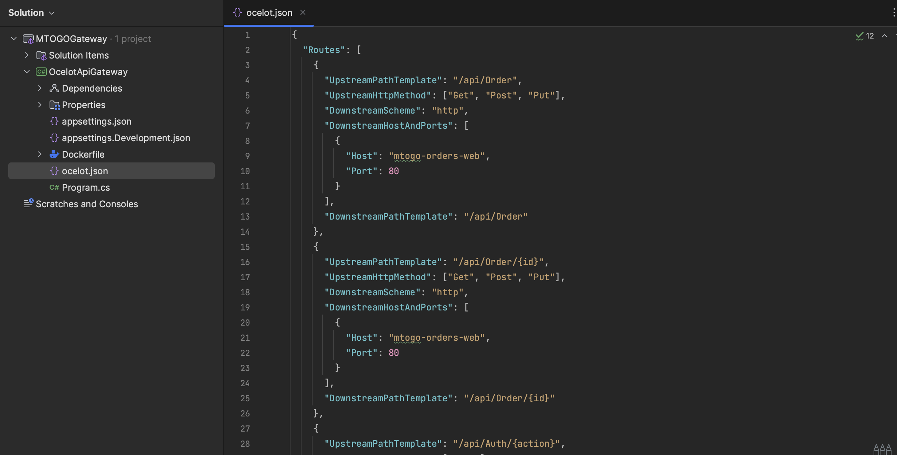
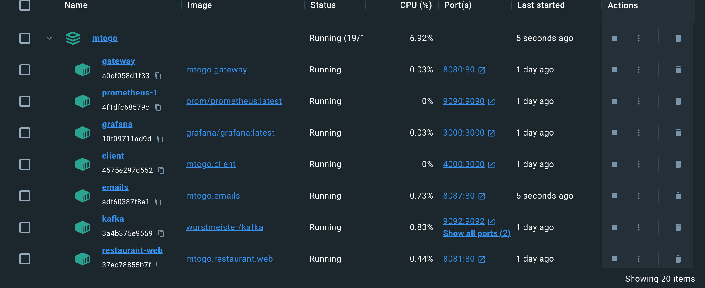
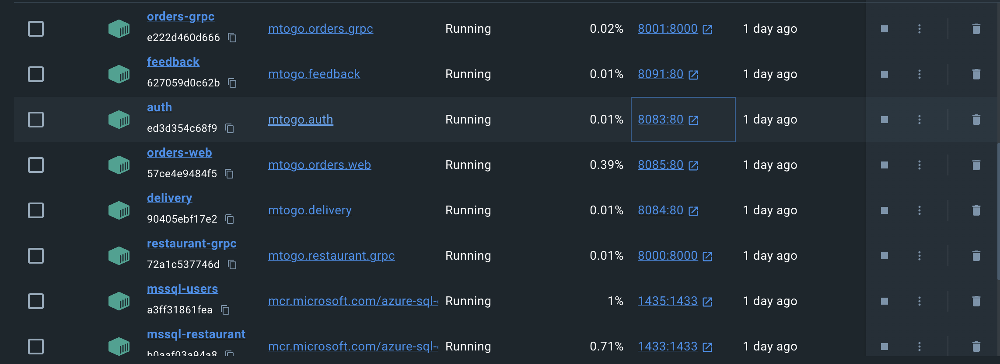
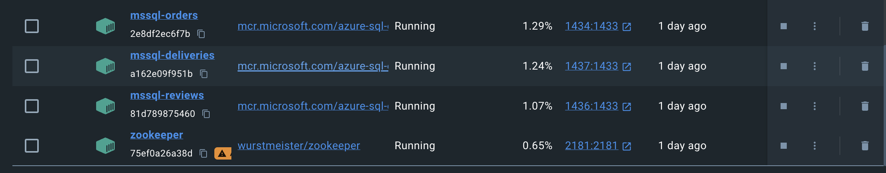

# Exam Repository - MTOGO #

## Contributors:

- **Frederik Bilgrav Andersen**: cph-fa116@cphbusiness.dk

- **Janus Stivang Rasmussen**: cph-jr270@cphbusiness.dk

- **Julius Krüger Madsen**: cph-jm352@cphbusiness.dk

# Table of Contents

1. [Setup](#setup)
2. [Legacy System](#legacy-system)
    - [Monolithic Legacy System](#monolithic-legacy-system)
    - [External APIs](#external-apis)
3. [Microservice Repositories](#microservice-repositories)
    - [API Gateway](#api-gateway)
    - [Order Service](#order-service)
    - [Restaurant Service](#restaurant-service)
    - [Auth Service](#auth-service)
    - [Feedback Service](#feedback-service)
    - [Delivery Service](#delivery-service)
    - [Email Service](#email-service)
    - [Notification Service](#notification-service)
4. [Architecture & Design](#architecture)
    - [BPMN Diagram (Create Order Flow)](#bpmn-diagram-create-order-flow)
    - [Legacy Domain Model](#legacy-domain-model)
    - [Subdomains](#subdomains)
    - [Usecase Diagram](#usecase-diagram)
9. [Docker](#docker)


## Setup
1. Clone this repository
2. In the root folder, copy and paste this command:
```docker-compose -f docker-compose.yml up -d --build```

## Legacy System
### Monolthic Legacy System
[Monolithic Legacy System](https://github.com/Dare-Share-Care/exam-orders)


Prior to the development of the MTOGO Microservice Platform, we started development of a monolithic single-codebase system with the same functionality. This is to demonstrate, the usual flow where projects start as monolithic, and as scaling requirements and other variables are in-demand, it allows for refactoring to microservice architecture.

### External APIs
To make use another existing "legacy system" that could complement our application, we decided to take use of an external geolocation API to convert the customers address from the created order to latitude and longitude. We did this to make use of another external API on our client-side providing a map of each active delivery as courier has claimed providing real-time navigation on the MTOGO platform for our couriers.

The APIs in question:

1. [LocationIQ (Geolocation API)](https://locationiq.com/)

2. [React Leaflet (React component for integrated maps)](https://react-leaflet.js.org/)

### External APIs

## Microservice Repositories ##

### API Gateway
[API Gateway](https://github.com/Dare-Share-Care/exam-gateway)  
handles the connection between the client and each microservice and serves as a main entrypoint. It is made using the Ocelot framework for .NET Core. The routing to each microservice corresponding API is configured in the ocelot.json file. Through ocelot, it is also possible to integrate load balancing and service discovery for distributed systems, however we did not implement this function yet.
  

### Order Service
[Order Service](https://github.com/Dare-Share-Care/exam-orders)
handles creation and storage of orders made through the MTOGO platform.
  

### Restaurant Service
[Restaurant Service](https://github.com/Dare-Share-Care/exam-restaurant)
handles creation, storage and presentation of restaurant data and their corresponding menus
 

### Auth Service
[Auth Service](https://github.com/Dare-Share-Care/exam-auth)
handles creation and storage of users. Also provides JWT based auth for the API Gateway to access role protected endpoints across our microservices
  

### Feedback Service
[Feedback Service](https://github.com/Dare-Share-Care/exam-feedback)
allows users to submit reviews on their completed orders.
  

### Delivery Service
[Delivery Service](https://github.com/Dare-Share-Care/exam-courier)
handles the delivery of submitted orders as well as navigation for the individual courier and the corresponding delivery they have claimed.
 

### Email Service
[Email Service](https://github.com/Dare-Share-Care/exam-emails)
handles email sending through event-driven messages sent from various microservices. Currently as we're in the development phase, each email is caught by Mailtrap, which is an external email-testing platform.

### Notification Service
[Notification Service](https://github.com/Dare-Share-Care/exam-notification)
We did not start development on the notification service - the idea was to send notifications to various clients and their corresponding users using web sockets.

## Architecture & Design
The MTOGO Microservice Architecture (as of current development)


## BPMN Diagram (Create Order Flow)


## Legacy System Domain Model


## Subdomains


## Usecase Diagram


## Docker
These are the docker containers on the MTOGO platform. As a container orchestrator, we use docker compose. Our `docker-compose.yml` file can be found [here](docker-compose.yml):








