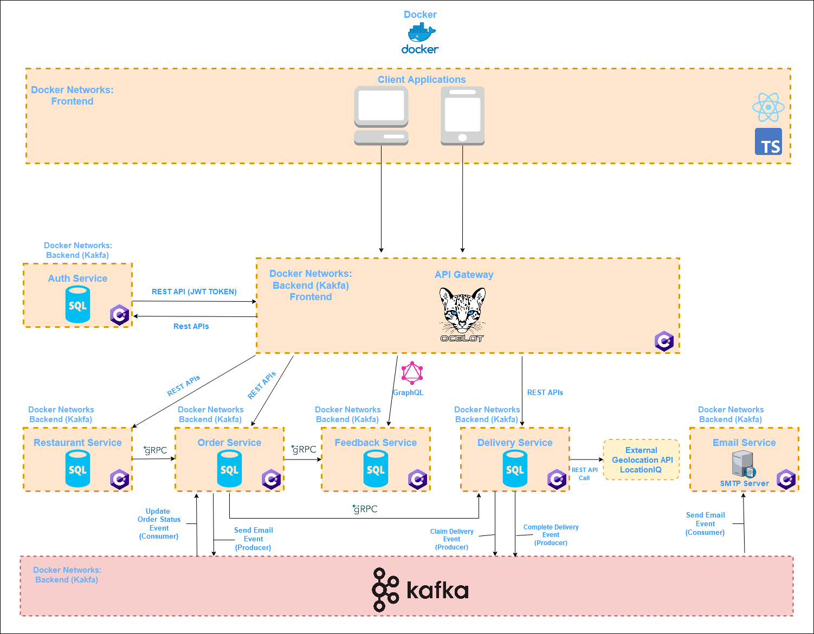
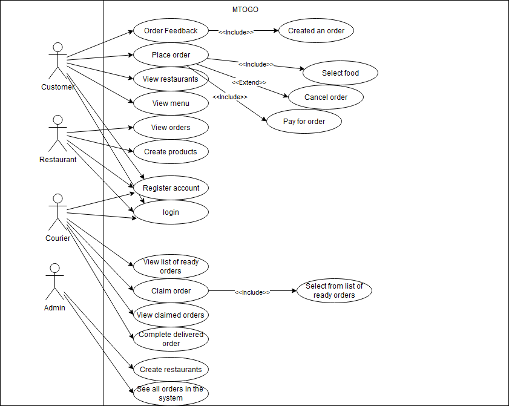

# Exam Repository for group Dare Share Care #
- **Frederik Bilgrav Andersen**: cph-fa116@cphbusiness.dk

- **Janus Stivang Rasmussen**: cph-jr270@cphbusiness.dk

- **Julius Krüger Madsen**: cph-jm352@cphbusiness.dk

## Setup
1. Clone this repository
2. In the root folder, copy and paste this command:
```docker-compose -f docker-compose.yml up -d --build```


## Microservice Repositories ##

### API Gateway
[API Gateway](https://github.com/Dare-Share-Care/exam-gateway)  
handles the connection between the client and each microservice. It is made using the Ocelot framework for .NET

### Order Service
[Order Service](https://github.com/Dare-Share-Care/exam-orders)
handles creation and storage of orders made through the MTOGO platform.
  

### Restaurant Service
[Restaurant Service](https://github.com/Dare-Share-Care/exam-restaurant)
handles creation, storage and presentation of restaurant data and their corresponding menus
 

### Auth Service
[Auth Service](https://github.com/Dare-Share-Care/exam-auth)
handles creation and storage of users. Also provides JWT based auth for the API Gateway to access role protected endpoints across our microservices
  

### Feedback Service
[Feedback Service](https://github.com/Dare-Share-Care/exam-feedback)
allows users to submit reviews on their completed orders.
  

### Delivery Service
[Delivery Service](https://github.com/Dare-Share-Care/exam-courier)
handles the delivery of submitted orders as well as navigation for the individual courier and the corresponding delivery they have claimed.
 

### Email Service
[Email Service](https://github.com/Dare-Share-Care/exam-emails)
handles email sending through event-driven messages sent from various microservices. Currently as we're in the development phase, each email is caught by Mailtrap, which is an external email-testing platform.

### Notification Service
[Notification Service](https://github.com/Dare-Share-Care/exam-notification)
We did not start development on the notification service - the idea was to send notifications to various clients and their corresponding users using web sockets.

## Architecture
The MTOGO Microservice architecture


## BPMN Diagram


## Legacy Domain Model


## Subdomains


## Usecase Diagram
